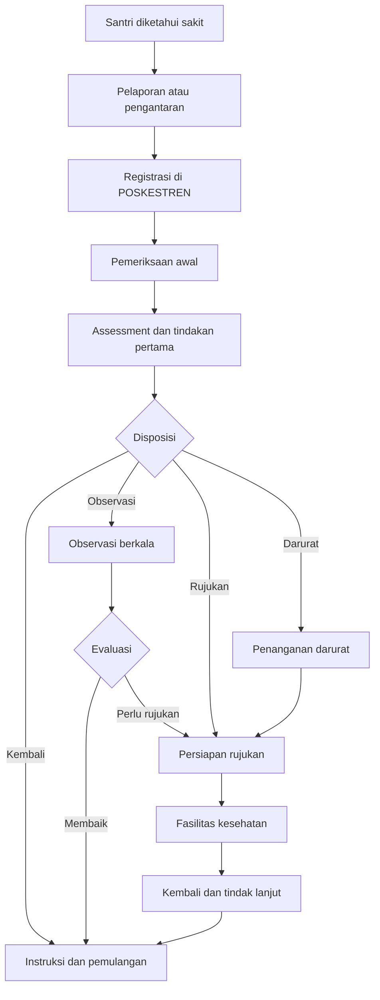

# Perjalanan Person sebagai Pasien



## Titik data utama

- Siapa menemukan/melaporkan.
- Lokasi asal.
- Waktu tiba.
- Keluhan.
- Tanda vital.
- Assessment.
- Tindakan.
- Disposisi.
- Status observasi.
- Obat.
- Rujukan.
- Instruksi akhir.
- Pihak yang diberi informasi.

## Risiko perjalanan

- Santri tidak benar-benar tiba di POSKESTREN.
- Kunjungan dibuat terlambat.
- Pergantian shift tanpa handover.
- Observasi tanpa monitoring.
- Obat diberikan tanpa pencatatan.
- Rujukan tidak ditutup.
- Santri kembali ke asrama tanpa status yang jelas.

## Variasi berdasarkan tipe pasien

- Santri: wajib mengikuti aturan lokasi POSKESTREN dan handover ke asrama/sekolah.
- Guru/staf/pengasuh: dapat datang ke POSKESTREN dan memperoleh workflow klinis yang sama, tetapi tanpa aturan keberadaan asrama.
- Pengguna manusia lain: mengikuti kebijakan organisasi yang ditetapkan.

## Cabang konsultasi eksternal

Setelah assessment, petugas dapat membuat `ClinicalConsultation`:

```text
Assessment
  -> Consultation Summary
  -> Secure transmission
  -> External advice
  -> Local clinical decision
  -> Observation | Discharge | Referral
```
