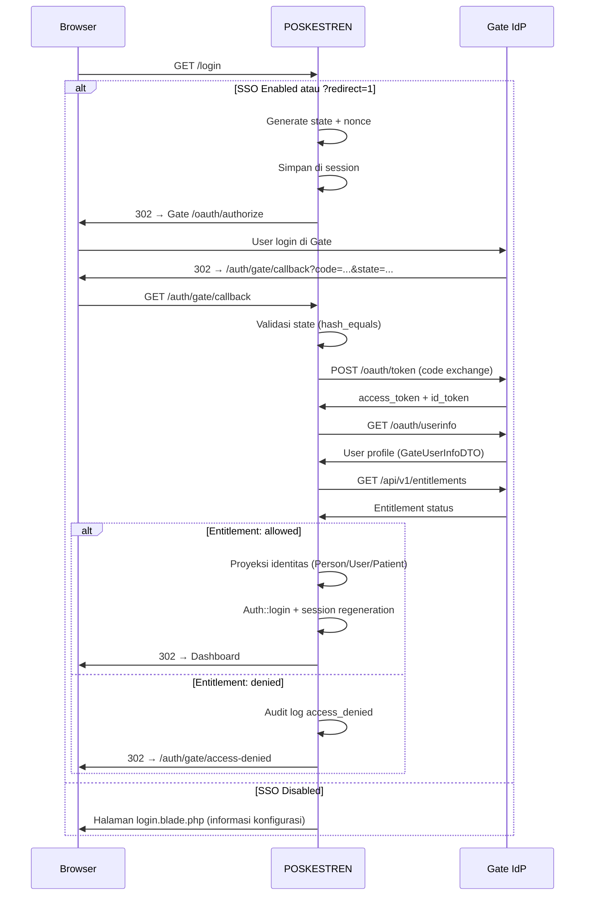
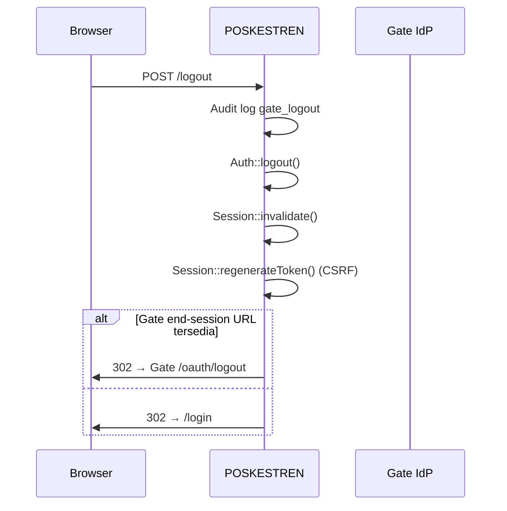
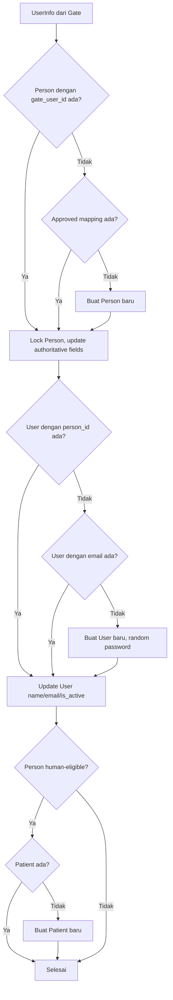
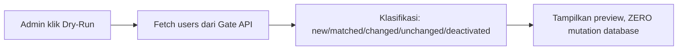
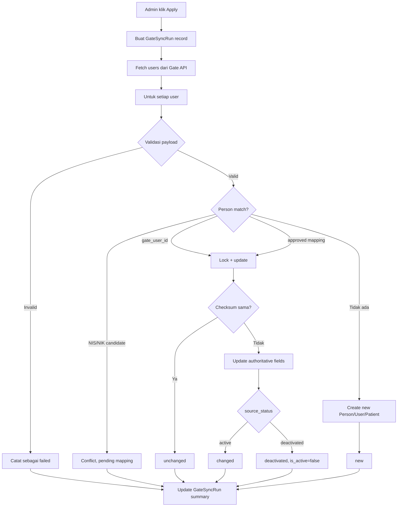
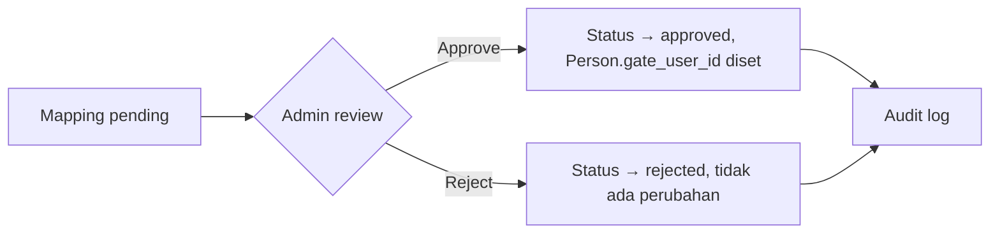

# Alur Login Gate dan Kontrol Akses

## 1. Alur Login Gate SSO

### 1.1 Prasyarat

- Gate SSO dikonfigurasi di `config/gate.php`
- Feature flag `GATE_SSO_ENABLED` diset `true` untuk production
- `GATE_CLIENT_DRIVER` diset `http` untuk production
- Client ID dan Client Secret terkonfigurasi di `.env`

### 1.2 Langkah-langkah Login



### 1.3 Error Handling

| Kondisi | Aksi |
|---|---|
| Gate mengembalikan error param | Audit log + redirect ke login |
| State mismatch | Audit log (CSRF risk) + redirect ke login |
| Code kosong | Redirect ke login |
| Token exchange gagal | Audit log + redirect ke login (pesan sanitized) |
| Entitlement ditolak | Audit log + redirect ke access-denied |

## 2. Alur Logout



## 3. Alur Proyeksi Identitas

### 3.1 Login-time Projection

Setiap kali pengguna login melalui Gate, sistem memproyeksikan identitas Gate ke model lokal:



### 3.2 Fields yang Di-update (Authoritative)

- `name`, `nik`, `nis_nip`, `email`, `phone`, `gender`
- `user_type`, `source_status`, `checksum`, `source_version`
- `source_updated_at`, `synced_at`

### 3.3 Fields yang TIDAK PERNAH Di-update

- Allergies, medical conditions, health profile
- Medical visits, observations, vital signs, assessments
- Medication orders, referrals, discharges, follow-ups

## 4. Alur Sync Apply

### 4.1 Dry-Run (Preview)



### 4.2 Apply (Eksekusi)



### 4.3 Otorisasi Sync

| Aksi | Permission | Policy |
|---|---|---|
| View sync dashboard | `view-gate-sync` | `GateSyncPolicy` |
| Execute dry-run | `view-gate-sync` | `GateSyncPolicy` |
| Execute apply | `execute-gate-sync-apply` | `GateSyncPolicy` |
| View run detail | `view-gate-sync` | `GateSyncPolicy` |

## 5. Alur Rekonsiliasi

### 5.1 Identifikasi Konflik

Saat sync apply menemukan NIS/NIP/NIK match tanpa `gate_user_id`:
1. Record `gate_identity_mappings` dibuat dengan `status = 'pending'`
2. Muncul di halaman rekonsiliasi
3. Admin meninjau dan menyetujui/menolak

### 5.2 Approval Flow



### 5.3 Otorisasi Rekonsiliasi

| Aksi | Permission |
|---|---|
| View reconciliation | `view-gate-reconciliation` |
| Approve mapping | `manage-identity-mappings` |
| Reject mapping | `manage-identity-mappings` |

## 6. Kontrol Akses Entitlement

### 6.1 Login-time

```text
Gate Entitlement Status → Aksi POSKESTREN
─────────────────────────────────────────
allowed       → Login diizinkan
revoked       → Access denied, audit log
suspended     → Access denied, audit log
not_assigned  → Access denied, audit log
unknown       → Default deny
```

### 6.2 Runtime

Middleware `EnforceGateApplicationEntitlement` memeriksa `user->is_active` pada setiap request:
- `is_active = false` → force logout + redirect ke login

### 6.3 Pemisahan Entitlement dan Permission Klinis

> [!IMPORTANT]
> **Entitlement** menentukan: boleh/tidak mengakses aplikasi POSKESTREN.
> **Permission klinis** ditentukan terpisah melalui role lokal dan permission server-side.
> Gate admin role **TIDAK** memberikan akses ke data medis.
