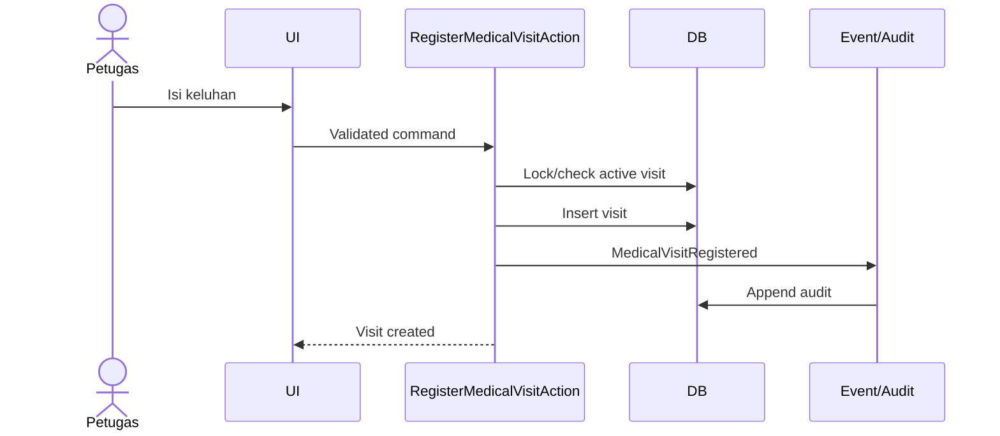

# Aliran Data

## Registrasi kunjungan

## Prinsip

- Actor berasal dari authentication context.
- Timestamp resmi dibuat server.
- Validasi client hanya bantuan UX.
- Side effect notifikasi berjalan setelah commit.
- Audit untuk transaksi kritis harus konsisten dengan hasil transaksi.
