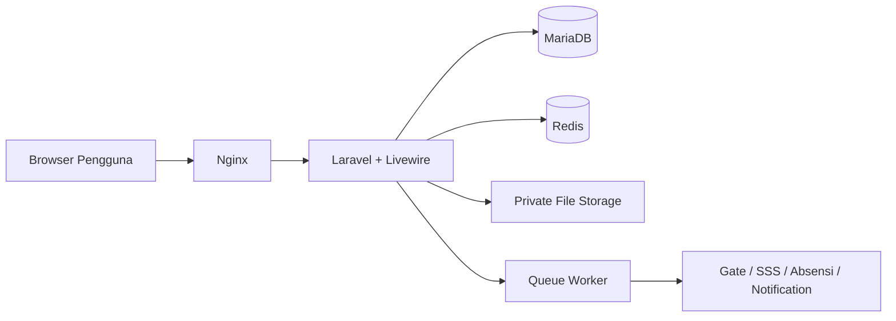
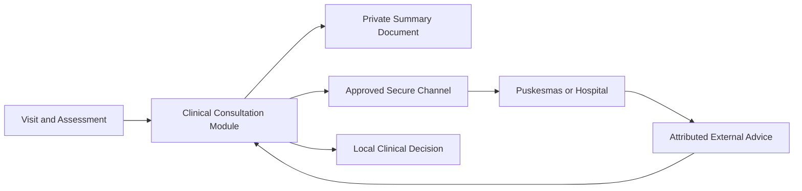

# Arsitektur Sistem

## Gaya arsitektur

Modular monolith dengan satu deployment utama. Modul domain memiliki boundary, action, policy, event, model, dan test masing-masing.

## Trust boundary

- Browser tidak dipercaya.
- Integrasi eksternal harus diautentikasi.
- Database adalah sumber kebenaran transaksi aplikasi.
- File medis tidak disajikan sebagai URL publik.
- Queue tidak boleh kehilangan context authorization/audit.

## Availability

MVP dioptimalkan untuk jaringan internal dan akses aman dari luar bila disediakan. Mode offline belum termasuk MVP.

## External clinical consultation boundary

Puskesmas/rumah sakit diperlakukan sebagai trust boundary eksternal. Tidak ada akses langsung ke database internal.
