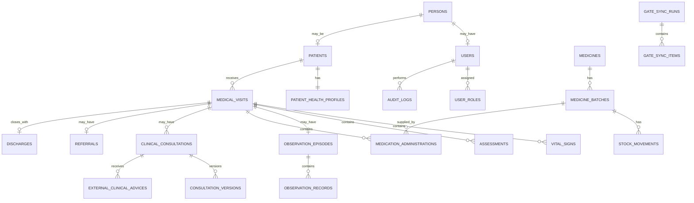

# Entity Relationships

```mermaid
erDiagram
    PERSONS ||--o| USERS : may_have
    PERSONS ||--o| PATIENTS : may_be
    USERS ||--o{ USER_ROLES : assigned
    PATIENTS ||--|| PATIENT_HEALTH_PROFILES : has
    PATIENTS ||--o{ MEDICAL_VISITS : receives
    MEDICAL_VISITS ||--o{ VITAL_SIGNS : contains
    MEDICAL_VISITS ||--o{ ASSESSMENTS : contains
    MEDICAL_VISITS ||--o| OBSERVATION_EPISODES : may_have
    OBSERVATION_EPISODES ||--o{ OBSERVATION_RECORDS : contains
    MEDICAL_VISITS ||--o{ MEDICATION_ADMINISTRATIONS : contains
    MEDICINES ||--o{ MEDICINE_BATCHES : has
    MEDICINE_BATCHES ||--o{ STOCK_MOVEMENTS : has
    MEDICINE_BATCHES ||--o{ MEDICATION_ADMINISTRATIONS : supplied_by
    MEDICAL_VISITS ||--o{ CLINICAL_CONSULTATIONS : may_have
    CLINICAL_CONSULTATIONS ||--o{ CONSULTATION_VERSIONS : versions
    CLINICAL_CONSULTATIONS ||--o{ EXTERNAL_CLINICAL_ADVICES : receives
    MEDICAL_VISITS ||--o| REFERRALS : may_have
    MEDICAL_VISITS ||--o| DISCHARGES : closes_with
    GATE_SYNC_RUNS ||--o{ GATE_SYNC_ITEMS : contains
    USERS ||--o{ AUDIT_LOGS : performs
```

Rekam medis merujuk patient, bukan account login. Hal ini mempertahankan riwayat ketika role atau status akun berubah.
