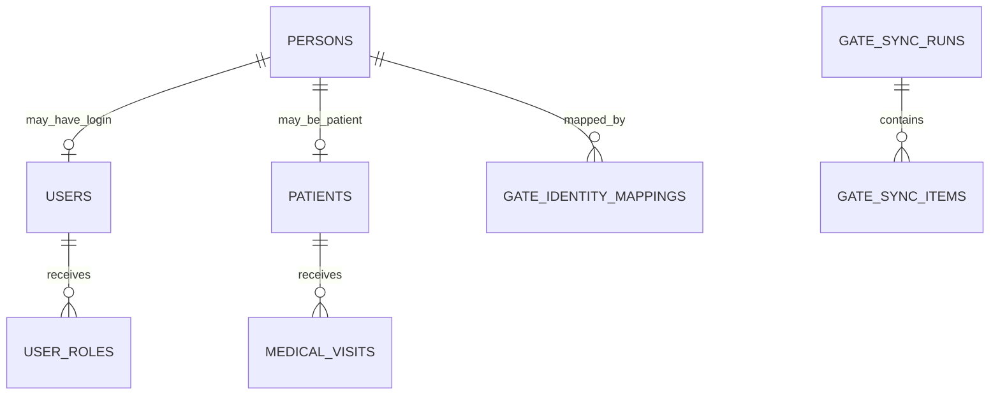

# Model Data Identitas dan Pasien

## Relasi

## `persons`

- id
- gate_user_id
- name
- primary_identifier
- email
- phone
- user_type
- organization attributes
- photo reference
- source_status
- source_updated_at
- source_version/checksum
- synced_at

## `users`

- id
- person_id nullable
- gate_user_id nullable
- username/email
- auth status
- last_login_at
- local development flag
- disabled_at

## `patients`

- id
- person_id unique
- patient_number unique
- eligibility_status
- created_reason
- first_seen_at

## `gate_sync_runs`

- id
- mode `dry_run|apply`
- started_at
- completed_at
- cursor
- source_version
- totals
- initiated_by
- status

## `gate_sync_items`

- sync_run_id
- gate_user_id
- action
- result
- conflict_type
- before_json
- source_json_hash
- message

## Invariants

- `gate_user_id` unik untuk person projection.
- Satu person maksimal satu patient.
- User role berubah tanpa mengubah person/patient ID.
- Deaktivasi user tidak cascade delete.
- Patient hanya dibuat untuk person manusia.
